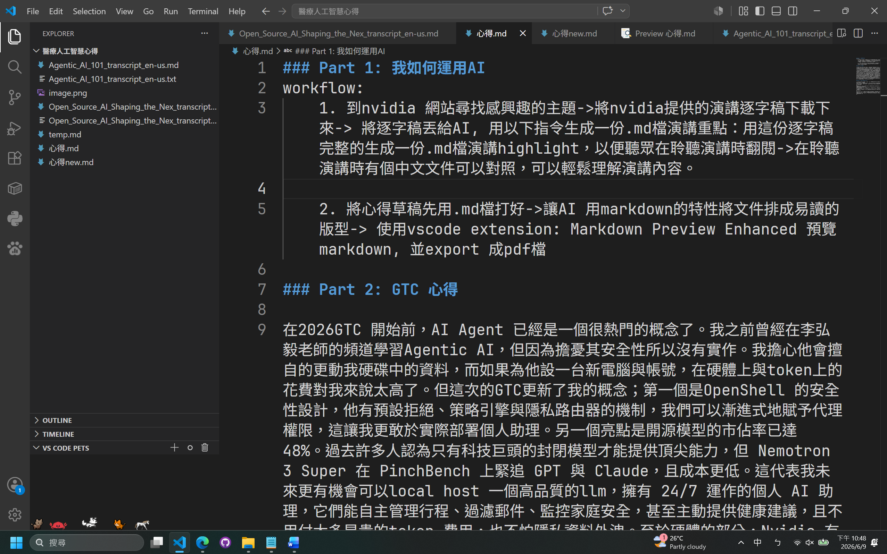

# AI 應用實錄：從個人工作流到 GTC 2026 與醫療專題
>  [Click here to visit my github repo](https://github.com/u114001042/Introduction-to-Artificial-Intelligence-in-Healthcare)
## 1. 我如何運用 AI

### 個人工作流

1. 至 NVIDIA 官方網站尋找感興趣的主題，並下載演講逐字稿。
2. 將逐字稿交由 AI，以下列指令生成一份 Markdown 演講重點：
   > 用這份逐字稿完整的生成一份.md檔演講highlight，以便聽眾在聆聽演講時翻閱
3. 在聆聽演講時，有一份中文對照文件，可輕鬆理解內容。

### 文件整理流程

1. 以 Markdown 撰寫心得草稿，如下圖。

2. 讓 AI 利用 Markdown 特性將文件排版為易讀版型：
    >將文件排成類似README.md版型，要偏報導式（冷靜、敘事），文句風格盡量和原本一樣。
3. 進行微調。
4. 使用 VS Code 擴充套件 **Markdown Preview Enhanced** 預覽並匯出為 PDF。
---

## 2. GTC 2026 心得

在 2026 GTC 開始前，AI Agent 已是一個熱門概念。我曾在李弘毅老師的頻道學習 Agentic AI，但出於安全性考量並未實作。主要擔憂是代理可能會擅自更動硬碟中的資料，而為其配置獨立電腦與帳號的硬體與 token 成本過高。

本次 GTC 更新了我的看法：

- **OpenShell 的安全設計**：採用預設拒絕、策略引擎與隱私路由器機制，可漸進式賦予代理權限，讓個人助理的部署更為可行。
- **開源模型的成長**：市佔率已達 48%。Nemotron 3 Super 在 PinchBench 上緊追 GPT 與 Claude，且成本更低。這代表未來有機會本地端部署高品質 LLM，實現 24/7 個人 AI 助理（行程管理、郵件過濾、家庭安全監控、健康建議），同時降低 token 費用與隱私外洩風險。
- **硬體支援**：NVIDIA 推出 DGX Spark（原價屋售價 NT$135,000），可本地運行 120B 參數模型。雖然個人難以負擔，但對實驗室經費而言並非難事，可大幅提升隱私資料研究效率。

> **我問 AI：** 我只會寫簡單的 Python，不懂 RL，真的能建一個有用的代理嗎？
>
> **AI 答：** 完全可以。你可以從 Build-A-Claw 這類視覺化工具開始（如同演講中展示的積木組裝），用拖拉方式選擇 LLM 腦、工具（如 Telegram、網頁搜尋）。或是直接安裝 OpenClaw，以自然語言描述需求，它會自動產生設定檔。

**References:**
- [Open Source AI Shaping the Next Era of Intelligent Digital Workers](https://www.nvidia.com/zh-tw/on-demand/session/gtc26-s81789/)
- [Agentic AI 101](https://www.nvidia.com/zh-tw/on-demand/session/gtc26-s82432/)

---

## 3. 本學期三場課程專題講座摘要與心得

### 臨床 AI 的突破

AI 正在從「輔助工具」進化為智慧醫療的核心。在臨床應用上，AI 展現了早期檢測、客觀判讀與快速分析的卓越優勢。從高醫心電圖 AI 的發展可見，僅需 2.4 秒的訊號，預測猝死風險的準確率竟可達 98.2%，並能結合皮膚交感神經活性 (SKNA) 評估自律神經，這在傳統醫療中是難以想像的精準度。

### 多模態 AI 與急重症應用

此外，多模態 AI 與生成式 AI（如 MedGemma 和 Delphi-2M）的突破，讓 AI 能整合圖像、文本與語音進行跨模態臨床推理，甚至預知未來 20 年的疾病風險。而在急重症領域，智慧 ICU 儀表板的建立，有效減少了數據誤讀並提升巡房效率，將醫療人員從繁瑣的資料收集轉向更核心的臨床決策。

### 醫學生的觀察與反思

身為一名醫學生，這讓我看見AI輔助的必然趨勢。

- 首先，我們不能只埋首於傳統書本，必須具備跨領域協作能力；如資料中高醫與中山、交大的跨校合作，顯示出醫學與工程整合是未來的必然趨勢。
- 其次，AI 的成功關鍵在於「人類參與流程 (Human in the loop)」，即使 AI 診斷正確率在研究中表現優異，但醫療的信任感與最終決策仍需醫師把關。
- 最後，AI 帶動的自動化病歷紀錄與預測模型，將把時間還給醫師。未來的醫師應從「數據收集者」轉型為「智慧決策者」與「人文關懷者」，善用科技來強化診斷，同時將更多精力投入於 AI 無法取代的病患情感支持與複雜倫理判斷中。